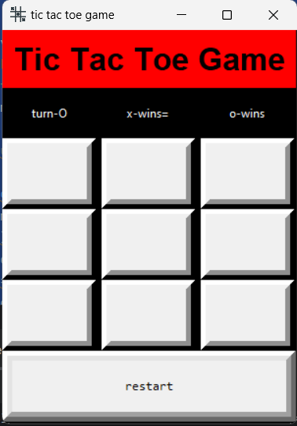
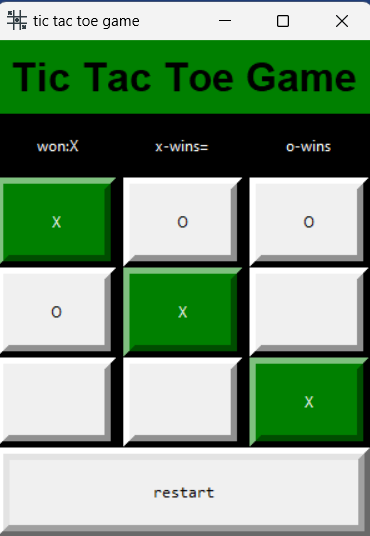
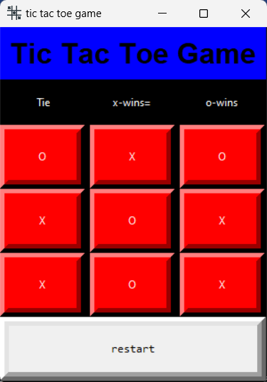

# Tic Tac Toe Game 💥

Challenge your friends to an exciting game of Tic Tac Toe and see who emerges as the ultimate winner! 🏆

🌟 **Features** 🌟
- Play as 'X' and 'O' against your friends!
- Real-time updates of player turns.
- Exciting glow effect on the game title 🌈.
- Win and tie detection with a cool green highlight 🎉.
- Quick game restart option with a single click 🔄.

📸 **Screenshots** 📸

🚀 **Getting Started** 🚀
1. Clone the repository.
2. Run the game using Python: `python tic_tac_toe.py`

🔗 **Requirements** 🔗
- Python (3.x)
- Tkinter library

🎮 **How to Play** 🎮
1. Start the game.
2. Choose your player: 'X' or 'O'.
3. Click on the grid cells to make your moves.
4. The first player to complete a row, column, or diagonal wins!
5. If all cells are filled and no winner is declared, it's a tie!

🧐 **Strategy Tip** 🧐
Try to anticipate your opponent's moves and plan ahead. Win by creating a winning combination before your opponent does!

🤝 **Contributing** 🤝
We welcome contributions! Feel free to open an issue or submit a pull request to enhance the game.

📝 **License** 📝
This project is licensed under the MIT License - see the [LICENSE](LICENSE) file for details.

👏 **Acknowledgements** 👏
- Thanks to the Tkinter community for providing a simple way to create GUI applications in Python.

Let's start playing and may the best player win! 🎉✨🕹️
